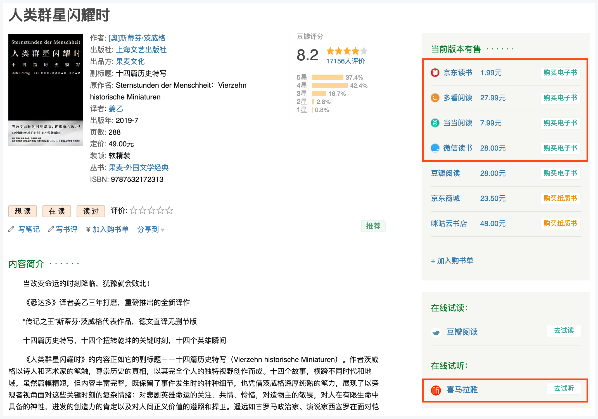

# 豆瓣读书助手
eBooks Assistant for douban.com, weread.qq.com .

为豆瓣读书页面添加微信读书、多看阅读、京东读书、当当云阅读、喜马拉雅等直达链接; 为微信读书增加豆瓣评分及链接。

## 主要功能

- 豆瓣读书页面
  - 添加微信读书在线试读链接；
  - 添加多看阅读在线试读链接；
  - 添加京东读书在线试读链接；
  - 添加当当云阅读在线试读链接；
  - 添加喜马拉雅在线试听链接。

 

- 微信读书页面
  - 添加豆瓣读书评分及链接。

## 安装使用

从 [Greasy Fork](https://greasyfork.org/en/scripts/412479-ebooks-assistant) 上安装油猴脚本。

安装后，浏览器访问下列链接，并点击浏览器右上角的油猴图标，选择 `eBooks Assistant` 脚本，即可看到效果。
  - 豆瓣读书页面： [https://book.douban.com/subject/34434342/](https://book.douban.com/subject/34434342/)
  - 微信读书页面： [https://weread.qq.com/web/bookDetail/9ef32b805abab59ef601a6c](https://weread.qq.com/web/bookDetail/9ef32b805abab59ef601a6c)

## 开放接口

本项目**免费提供**图书元数据（Metadata）API 接口，申请方法及使用说明见《API 参考文档》（[API Reference](references/API_Reference.md)）。

## 代码开源

本项目的服务端代码是开源的，你可以通过克隆代码的方式，**一键部署**自己的服务。

具体的部署步骤和要求，请参照《本地部署参考文档》（[Self-Hosted Reference](references/Self_Hosted_Reference.md)）部分。

## 请赞助本项目

如果你觉得本项目对你有所帮助，请考虑赞助我一杯咖啡以示支持。感谢你的慷慨！😊☕️

🥰 其他赞助方式：[爱发电](https://afdian.net/a/caspartse)

## 意见反馈

如果有任何问题，欢迎提交 [Issue](https://github.com/caspartse/eBooksAssistant/issues) 或加入 [Telegram 群组](https://t.me/+zeNNYQKkp71jNjc1) 交流讨论。

## License

The MIT License (MIT). See [LICENSE](LICENSE) file for more details.